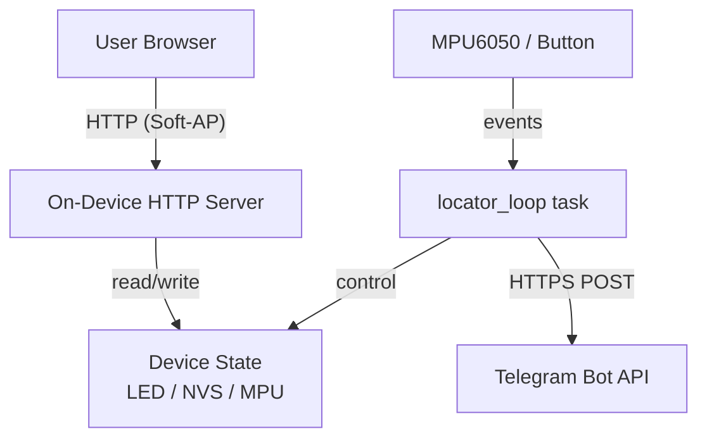

# SimFlow Locator App - High-Level Design (HLD)

## 1. Executive Summary
**SimFlow Locator** (codename `simpleBot`) is a portable tracker device that
detects lift / motion / over-temperature events and reports them to the user
via Telegram. The device hosts a Soft-AP and a small embedded web UI for local
configuration (Wi-Fi credentials, MPU baseline calibration, LED control).

Unlike the watering device, the locator has **no host-side middleware**: it
talks directly to the Telegram Bot API over HTTPS, and it serves its own UI
from the on-device HTTP server. The `locator_app/` folder therefore contains
the embedded web UI source and design docs, but no Python/Flask server.

## 2. System Architecture

### 2.1 Technology Stack
* **Firmware:** ESP-IDF 5.4 (C), running on ESP32-S3 (Xtensa).
* **Sensors / I/O:**
  * MPU6050 IMU on I2C (lift + motion + temperature)
  * WS2812 NeoPixel on GPIO 48 (status LED)
  * BOOT button on GPIO 0 (single/double/triple-click)
* **On-device Web UI:** static HTML + JS embedded at firmware build time
  from `locator_app/webui/index.html` (via IDF `EMBED_TXTFILES`).
* **Cloud Communication:** HTTPS POST to `api.telegram.org` (mbedtls + cert
  bundle).
* **Local Communication:** HTTP (browser <-> device) and Wi-Fi STA + Soft-AP.

### 2.2 Architecture Diagram

### 2.3 Firmware Module Layout (`locator_fw/`)
| Module                  | Responsibility                                          |
|-------------------------|---------------------------------------------------------|
| `sf_locator.c`          | `init_device()` / `device_start()`, Wi-Fi APSTA, loop task |
| `sf_locator_led.c`      | WS2812 NeoPixel: named/raw colors, blink, wifi-lost alert |
| `sf_locator_mpu.c`      | MPU6050 I2C driver + lift / motion-window / overheat state machine |
| `sf_locator_button.c`   | Debounced single / double / triple-click detection      |
| `sf_locator_telegram.c` | HTTPS `sendMessage` via `esp_http_client` + cert bundle |
| `sf_locator_web.c`      | Soft-AP bring-up, `esp_http_server` handlers, NVS persistence |

## 3. App Layout (`locator_app/`)
* `webui/index.html` - source of the on-device control page. Embedded into the
  firmware binary at build time; not served by any host process.
* `SimFlow_HLD.md` - this document.
* `integration_guide.md` - quick start + per-feature usage.

(No `server/` folder: the locator has no host middleware. If a host-side helper
is added later - e.g. a Telegram-bot dispatcher - it would live in
`locator_app/server/` analogous to `watering_app/server/`.)
